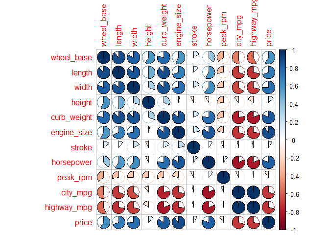

hw01-sofia-guo
================
Sofia
February 23, 2018

2) Data Import
==============

``` r
#Create character vector to give columns names
library(readr)
setwd("C:/Users/Sammy/Desktop/hw-stat133/hw01")
read_csv('imports-85.data')
```

    ## Parsed with column specification:
    ## cols(
    ##   .default = col_character(),
    ##   `3` = col_integer(),
    ##   `88.60` = col_double(),
    ##   `168.80` = col_double(),
    ##   `64.10` = col_double(),
    ##   `48.80` = col_double(),
    ##   `2548` = col_integer(),
    ##   `130` = col_integer(),
    ##   `9.00` = col_double(),
    ##   `21` = col_integer(),
    ##   `27` = col_integer()
    ## )

    ## See spec(...) for full column specifications.

    ## # A tibble: 204 x 26
    ##      `3` `?`   `alfa-romero` gas   std   two   convertible rwd   front
    ##    <int> <chr> <chr>         <chr> <chr> <chr> <chr>       <chr> <chr>
    ##  1     3 ?     alfa-romero   gas   std   two   convertible rwd   front
    ##  2     1 ?     alfa-romero   gas   std   two   hatchback   rwd   front
    ##  3     2 164   audi          gas   std   four  sedan       fwd   front
    ##  4     2 164   audi          gas   std   four  sedan       4wd   front
    ##  5     2 ?     audi          gas   std   two   sedan       fwd   front
    ##  6     1 158   audi          gas   std   four  sedan       fwd   front
    ##  7     1 ?     audi          gas   std   four  wagon       fwd   front
    ##  8     1 158   audi          gas   turbo four  sedan       fwd   front
    ##  9     0 ?     audi          gas   turbo two   hatchback   4wd   front
    ## 10     2 192   bmw           gas   std   two   sedan       rwd   front
    ## # ... with 194 more rows, and 17 more variables: `88.60` <dbl>, `168.80`
    ## #   <dbl>, `64.10` <dbl>, `48.80` <dbl>, `2548` <int>, dohc <chr>, four
    ## #   <chr>, `130` <int>, mpfi <chr>, `3.47` <chr>, `2.68` <chr>, `9.00`
    ## #   <dbl>, `111` <chr>, `5000` <chr>, `21` <int>, `27` <int>, `13495`
    ## #   <chr>

``` r
names <- c('symboling', 
           'normalized_losses', 
           'make', 
           'fuel_type',
           'aspiration',
           'num_of_doors',
           'body_style',
           'drive_wheels',
           'engine_location',
           'wheel_base',
           'length',
           'width',
           'height',
           'curb_weight',
           'engine_type',
           'num_of_cylinders',
           'engine_size',
           'fuel_system',
           'bore',
           'stroke',
           'compression_ratio',
           'horsepower',
           'peak_rpm',
           'city_mpg',
           'highway_mpg',
           'price')
#Use read.csv to import the data
classes <- c('numeric',
             'numeric',
             'character',
             'character',
             'character',
             'character',
             'character',
             'character',
             'character',
             'numeric',
             'numeric',
             'numeric',
             'numeric',
             'integer',
             'character',
             'character',
             'integer',
             'character',
             'numeric',
             'numeric',
             'numeric',
             'integer',
             'integer',
             'integer',
             'integer',
             'integer'
             )
import <- read.csv('imports-85.data', col.names = names, na.strings = '?', colClasses = classes)
str(import)
```

    ## 'data.frame':    204 obs. of  26 variables:
    ##  $ symboling        : num  3 1 2 2 2 1 1 1 0 2 ...
    ##  $ normalized_losses: num  NA NA 164 164 NA 158 NA 158 NA 192 ...
    ##  $ make             : chr  "alfa-romero" "alfa-romero" "audi" "audi" ...
    ##  $ fuel_type        : chr  "gas" "gas" "gas" "gas" ...
    ##  $ aspiration       : chr  "std" "std" "std" "std" ...
    ##  $ num_of_doors     : chr  "two" "two" "four" "four" ...
    ##  $ body_style       : chr  "convertible" "hatchback" "sedan" "sedan" ...
    ##  $ drive_wheels     : chr  "rwd" "rwd" "fwd" "4wd" ...
    ##  $ engine_location  : chr  "front" "front" "front" "front" ...
    ##  $ wheel_base       : num  88.6 94.5 99.8 99.4 99.8 ...
    ##  $ length           : num  169 171 177 177 177 ...
    ##  $ width            : num  64.1 65.5 66.2 66.4 66.3 71.4 71.4 71.4 67.9 64.8 ...
    ##  $ height           : num  48.8 52.4 54.3 54.3 53.1 55.7 55.7 55.9 52 54.3 ...
    ##  $ curb_weight      : int  2548 2823 2337 2824 2507 2844 2954 3086 3053 2395 ...
    ##  $ engine_type      : chr  "dohc" "ohcv" "ohc" "ohc" ...
    ##  $ num_of_cylinders : chr  "four" "six" "four" "five" ...
    ##  $ engine_size      : int  130 152 109 136 136 136 136 131 131 108 ...
    ##  $ fuel_system      : chr  "mpfi" "mpfi" "mpfi" "mpfi" ...
    ##  $ bore             : num  3.47 2.68 3.19 3.19 3.19 3.19 3.19 3.13 3.13 3.5 ...
    ##  $ stroke           : num  2.68 3.47 3.4 3.4 3.4 3.4 3.4 3.4 3.4 2.8 ...
    ##  $ compression_ratio: num  9 9 10 8 8.5 8.5 8.5 8.3 7 8.8 ...
    ##  $ horsepower       : int  111 154 102 115 110 110 110 140 160 101 ...
    ##  $ peak_rpm         : int  5000 5000 5500 5500 5500 5500 5500 5500 5500 5800 ...
    ##  $ city_mpg         : int  21 19 24 18 19 19 19 17 16 23 ...
    ##  $ highway_mpg      : int  27 26 30 22 25 25 25 20 22 29 ...
    ##  $ price            : int  16500 16500 13950 17450 15250 17710 18920 23875 NA 16430 ...

``` r
#Use read_csv to import the data
read_csv('imports-85.data', col_names = names)
```

    ## Parsed with column specification:
    ## cols(
    ##   .default = col_character(),
    ##   symboling = col_integer(),
    ##   wheel_base = col_double(),
    ##   length = col_double(),
    ##   width = col_double(),
    ##   height = col_double(),
    ##   curb_weight = col_integer(),
    ##   engine_size = col_integer(),
    ##   compression_ratio = col_double(),
    ##   city_mpg = col_integer(),
    ##   highway_mpg = col_integer()
    ## )
    ## See spec(...) for full column specifications.

    ## # A tibble: 205 x 26
    ##    symboling normalized_losses make      fuel_type aspiration num_of_doors
    ##        <int> <chr>             <chr>     <chr>     <chr>      <chr>       
    ##  1         3 ?                 alfa-rom~ gas       std        two         
    ##  2         3 ?                 alfa-rom~ gas       std        two         
    ##  3         1 ?                 alfa-rom~ gas       std        two         
    ##  4         2 164               audi      gas       std        four        
    ##  5         2 164               audi      gas       std        four        
    ##  6         2 ?                 audi      gas       std        two         
    ##  7         1 158               audi      gas       std        four        
    ##  8         1 ?                 audi      gas       std        four        
    ##  9         1 158               audi      gas       turbo      four        
    ## 10         0 ?                 audi      gas       turbo      two         
    ## # ... with 195 more rows, and 20 more variables: body_style <chr>,
    ## #   drive_wheels <chr>, engine_location <chr>, wheel_base <dbl>, length
    ## #   <dbl>, width <dbl>, height <dbl>, curb_weight <int>, engine_type
    ## #   <chr>, num_of_cylinders <chr>, engine_size <int>, fuel_system <chr>,
    ## #   bore <chr>, stroke <chr>, compression_ratio <dbl>, horsepower <chr>,
    ## #   peak_rpm <chr>, city_mpg <int>, highway_mpg <int>, price <chr>

``` r
typescsv <- c('ddcccccccddddiccicdddiiiii')
importcsv <- read_csv('imports-85.data', col_names = names, col_types = typescsv)
```

    ## Warning in rbind(names(probs), probs_f): number of columns of result is not
    ## a multiple of vector length (arg 1)

    ## Warning: 57 parsing failures.
    ## row # A tibble: 5 x 5 col     row col               expected actual file              expected   <int> <chr>             <chr>    <chr>  <chr>             actual 1     1 normalized_losses a double ?      'imports-85.data' file 2     2 normalized_losses a double ?      'imports-85.data' row 3     3 normalized_losses a double ?      'imports-85.data' col 4     6 normalized_losses a double ?      'imports-85.data' expected 5     8 normalized_losses a double ?      'imports-85.data'
    ## ... ................. ... ........................................................... ........ ........................................................... ...... ........................................................... .... ........................................................... ... ........................................................... ... ........................................................... ........ ...........................................................
    ## See problems(...) for more details.

``` r
str(importcsv)
```

    ## Classes 'tbl_df', 'tbl' and 'data.frame':    205 obs. of  26 variables:
    ##  $ symboling        : num  3 3 1 2 2 2 1 1 1 0 ...
    ##  $ normalized_losses: num  NA NA NA 164 164 NA 158 NA 158 NA ...
    ##  $ make             : chr  "alfa-romero" "alfa-romero" "alfa-romero" "audi" ...
    ##  $ fuel_type        : chr  "gas" "gas" "gas" "gas" ...
    ##  $ aspiration       : chr  "std" "std" "std" "std" ...
    ##  $ num_of_doors     : chr  "two" "two" "two" "four" ...
    ##  $ body_style       : chr  "convertible" "convertible" "hatchback" "sedan" ...
    ##  $ drive_wheels     : chr  "rwd" "rwd" "rwd" "fwd" ...
    ##  $ engine_location  : chr  "front" "front" "front" "front" ...
    ##  $ wheel_base       : num  88.6 88.6 94.5 99.8 99.4 ...
    ##  $ length           : num  169 169 171 177 177 ...
    ##  $ width            : num  64.1 64.1 65.5 66.2 66.4 66.3 71.4 71.4 71.4 67.9 ...
    ##  $ height           : num  48.8 48.8 52.4 54.3 54.3 53.1 55.7 55.7 55.9 52 ...
    ##  $ curb_weight      : int  2548 2548 2823 2337 2824 2507 2844 2954 3086 3053 ...
    ##  $ engine_type      : chr  "dohc" "dohc" "ohcv" "ohc" ...
    ##  $ num_of_cylinders : chr  "four" "four" "six" "four" ...
    ##  $ engine_size      : int  130 130 152 109 136 136 136 136 131 131 ...
    ##  $ fuel_system      : chr  "mpfi" "mpfi" "mpfi" "mpfi" ...
    ##  $ bore             : num  3.47 3.47 2.68 3.19 3.19 3.19 3.19 3.19 3.13 3.13 ...
    ##  $ stroke           : num  2.68 2.68 3.47 3.4 3.4 3.4 3.4 3.4 3.4 3.4 ...
    ##  $ compression_ratio: num  9 9 9 10 8 8.5 8.5 8.5 8.3 7 ...
    ##  $ horsepower       : int  111 111 154 102 115 110 110 110 140 160 ...
    ##  $ peak_rpm         : int  5000 5000 5000 5500 5500 5500 5500 5500 5500 5500 ...
    ##  $ city_mpg         : int  21 21 19 24 18 19 19 19 17 16 ...
    ##  $ highway_mpg      : int  27 27 26 30 22 25 25 25 20 22 ...
    ##  $ price            : int  13495 16500 16500 13950 17450 15250 17710 18920 23875 NA ...
    ##  - attr(*, "problems")=Classes 'tbl_df', 'tbl' and 'data.frame': 57 obs. of  5 variables:
    ##   ..$ row     : int  1 2 3 6 8 10 10 15 16 17 ...
    ##   ..$ col     : chr  "normalized_losses" "normalized_losses" "normalized_losses" "normalized_losses" ...
    ##   ..$ expected: chr  "a double" "a double" "a double" "a double" ...
    ##   ..$ actual  : chr  "?" "?" "?" "?" ...
    ##   ..$ file    : chr  "'imports-85.data'" "'imports-85.data'" "'imports-85.data'" "'imports-85.data'" ...
    ##  - attr(*, "spec")=List of 2
    ##   ..$ cols   :List of 26
    ##   .. ..$ symboling        : list()
    ##   .. .. ..- attr(*, "class")= chr  "collector_double" "collector"
    ##   .. ..$ normalized_losses: list()
    ##   .. .. ..- attr(*, "class")= chr  "collector_double" "collector"
    ##   .. ..$ make             : list()
    ##   .. .. ..- attr(*, "class")= chr  "collector_character" "collector"
    ##   .. ..$ fuel_type        : list()
    ##   .. .. ..- attr(*, "class")= chr  "collector_character" "collector"
    ##   .. ..$ aspiration       : list()
    ##   .. .. ..- attr(*, "class")= chr  "collector_character" "collector"
    ##   .. ..$ num_of_doors     : list()
    ##   .. .. ..- attr(*, "class")= chr  "collector_character" "collector"
    ##   .. ..$ body_style       : list()
    ##   .. .. ..- attr(*, "class")= chr  "collector_character" "collector"
    ##   .. ..$ drive_wheels     : list()
    ##   .. .. ..- attr(*, "class")= chr  "collector_character" "collector"
    ##   .. ..$ engine_location  : list()
    ##   .. .. ..- attr(*, "class")= chr  "collector_character" "collector"
    ##   .. ..$ wheel_base       : list()
    ##   .. .. ..- attr(*, "class")= chr  "collector_double" "collector"
    ##   .. ..$ length           : list()
    ##   .. .. ..- attr(*, "class")= chr  "collector_double" "collector"
    ##   .. ..$ width            : list()
    ##   .. .. ..- attr(*, "class")= chr  "collector_double" "collector"
    ##   .. ..$ height           : list()
    ##   .. .. ..- attr(*, "class")= chr  "collector_double" "collector"
    ##   .. ..$ curb_weight      : list()
    ##   .. .. ..- attr(*, "class")= chr  "collector_integer" "collector"
    ##   .. ..$ engine_type      : list()
    ##   .. .. ..- attr(*, "class")= chr  "collector_character" "collector"
    ##   .. ..$ num_of_cylinders : list()
    ##   .. .. ..- attr(*, "class")= chr  "collector_character" "collector"
    ##   .. ..$ engine_size      : list()
    ##   .. .. ..- attr(*, "class")= chr  "collector_integer" "collector"
    ##   .. ..$ fuel_system      : list()
    ##   .. .. ..- attr(*, "class")= chr  "collector_character" "collector"
    ##   .. ..$ bore             : list()
    ##   .. .. ..- attr(*, "class")= chr  "collector_double" "collector"
    ##   .. ..$ stroke           : list()
    ##   .. .. ..- attr(*, "class")= chr  "collector_double" "collector"
    ##   .. ..$ compression_ratio: list()
    ##   .. .. ..- attr(*, "class")= chr  "collector_double" "collector"
    ##   .. ..$ horsepower       : list()
    ##   .. .. ..- attr(*, "class")= chr  "collector_integer" "collector"
    ##   .. ..$ peak_rpm         : list()
    ##   .. .. ..- attr(*, "class")= chr  "collector_integer" "collector"
    ##   .. ..$ city_mpg         : list()
    ##   .. .. ..- attr(*, "class")= chr  "collector_integer" "collector"
    ##   .. ..$ highway_mpg      : list()
    ##   .. .. ..- attr(*, "class")= chr  "collector_integer" "collector"
    ##   .. ..$ price            : list()
    ##   .. .. ..- attr(*, "class")= chr  "collector_integer" "collector"
    ##   ..$ default: list()
    ##   .. ..- attr(*, "class")= chr  "collector_guess" "collector"
    ##   ..- attr(*, "class")= chr "col_spec"

3) Technical Questions about importing data
===========================================

1.  For the numerical values, the function takes the first value in each column preceded by an x and makes that the name of the column. For the character columns, the function takes the first character entry in each column as the name of the column.

2.  The function takes the index of each column and puts a "v" in front of each one to make a name for the column.

3.  For the read\_csv function, it automatically sets missing values to NA without me having to specify which symbol is a missing value. However, for the read.csv function, if I don't specify the symbol for the missing value, the function does not complete because it gets confused (in my error message it states "expected 'a real', got'?'") and doesn't complete the assignment of data types.

4.  The data frame imported in the second option is bigger because it holds more information that you specified (the data type of each column) than the unspecified version, where the read function has default settings that take up less memory than longer, more complex information. The specified data frame not only has to hold the original data type information but also the new specified conversion.

5.  Converting dat into an R matrix will coerce all the data values into a single data type, as matrices in R are atomic structures (all data must be the same type) whereas your original data frame is made of lists, which is non-atomic and can hold different data types in the same frame.

4) Practice base plotting
=========================

``` r
#Histogram with color, red
hist(import$price, col = 'red')
```

 Description: Skewed right histogram of car prices

``` r
#Horizontal Boxplot
boxplot(import$horsepower, plot = TRUE, horizontal = TRUE)
```

 Description: Boxplot of each car's horsepower showing a median around 95, max around 180 and min around 50.

``` r
#Barplot by body style
library(magrittr)
library(dplyr)
```

    ## 
    ## Attaching package: 'dplyr'

    ## The following objects are masked from 'package:stats':
    ## 
    ##     filter, lag

    ## The following objects are masked from 'package:base':
    ## 
    ##     intersect, setdiff, setequal, union

``` r
body_style_grouped <- import %>% mutate(count = 1) %>% group_by(body_style) %>% summarize(sum = sum(count))
decreasing <- arrange(body_style_grouped, desc(sum))
barplot(decreasing$sum, names.arg = decreasing$body_style)
```

 Description: Barplot of number of each body style in the data frame showing sedans as most common and convertibles as least common.

``` r
#stars() plot of vehicles with turbo aspiration using only variables wheel-base, length, width, height and price
import %>% filter(aspiration == 'turbo') %>% select(wheel_base, length, width, height, price) %>% stars()
```

 Description: Stars plot showing each "turbo" aspiration car's plot of wheel base, length, width, height and price.

5) Summaries:
=============

``` r
#a. mean price of gas and diesel cars
import %>% filter(fuel_type == 'gas') %>% summarize(meanprice = mean(price, na.rm = TRUE))
```

    ##   meanprice
    ## 1  12913.19

``` r
import %>% filter(fuel_type == 'diesel') %>% summarize(meanprice = mean(price, na.rm = TRUE))
```

    ##   meanprice
    ## 1  15838.15

``` r
#b. make of 12 cylinder car
import %>% filter(num_of_cylinders == 'twelve') %>% select(make)
```

    ##     make
    ## 1 jaguar

``` r
#c. make that has the most diesel cars
import %>% mutate(count = 1) %>% filter(fuel_type == 'diesel') %>% group_by(make) %>% summarize(sum = sum(count)) %>% arrange(desc(sum)) %>% slice(1) %>% select(1)
```

    ## # A tibble: 1 x 1
    ##   make  
    ##   <chr> 
    ## 1 peugot

``` r
#d. price of the car with greatest horsepower
import %>% arrange(desc(horsepower)) %>% slice(1) %>% select(price)
```

    ## # A tibble: 1 x 1
    ##   price
    ##   <int>
    ## 1    NA

``` r
#e. bottom 10th percentile of city_mpg
cityquant <- quantile(import$city_mpg, probs = seq(0, 1, by= 0.1))
cityquant[2]
```

    ## 10% 
    ##  17

``` r
#f. top 10th percentile of highway_mpg
highquant <- quantile(import$highway_mpg, probs = seq(0, 1, by= 0.1))
highquant[9]
```

    ## 80% 
    ##  37

``` r
#g. median price of cars in bottom 10th percentile of city_mpg
import %>% arrange(desc(city_mpg)) %>% filter(city_mpg <= cityquant[2]) %>% summarize(mediancars = median(price, na.rm = TRUE))
```

    ##   mediancars
    ## 1      32250

6) Technical Questions about data frames
========================================

1.  The function outputs a NULL value.

2.  mtcars\[ ,mpg\]

3.  Without the quotations around mpg signaling the program that mpg is a character, it interprets just mpg as a named object, which is undefined (as the column name in the data fram is part of a list, not an object on its own).

4.  NO, you can't add a list (which is what rows are in a data frame) as a column unless the list contains all data of the same type (which then it would be an atomic vector). This is because data frame columns must each have a single type of data, so adding a list with different data types as a column would not be possible.

5.  as.list(mtcars) coerces the data frame into a list of multiple vectors (separates out each column into a vector).

6.  To convert abc into a data frame, you would use the function data.frame(abc).

7) Correlations of quantitative variables
=========================================

``` r
#compute matrix of correlations between rest of quantitative variables
quant1 <- import[ ,-(1:2)] #take out first two columns
quant <- quant1[ , c(8:12, 15, 18, 20:24)] #select all other numerical columns
quant2 <- as_tibble(quant) #for checking variables
#omit NA values
quant3 <- na.omit(quant2)
#correlation matrix
qdat <- cor(quant3)
#Corrplot 1
library(corrplot)
```

    ## corrplot 0.84 loaded

``` r
corrplot(qdat, type='lower', order = 'hclust', tl.srt=45)
```


``` r
#Corrplot 2
corrplot(qdat, method='pie')
```

 Comments on the correlation plots: a. In the first correlogram, we notice that almost uniformly, all car-dimensions and specs (horsepower, engine size, length, width, weight) are strongly negatively correlated with city and highway miles per gallon. This type of correlation suggests that cars in this dataset which have more horsepowe and are larger tend to have the lowest city and highway miles per gallon. Something interesting to note is also that price is strongly negatively correlated with both mpg's- suggesting that the bigger cars may in fact happen to be more expensive.

1.  In the second correlogram, the pie displays give a little more specificity in regards to each degree of correlation (whereas the first diagram used the saturation of color as a sign of correlation level). We can try to zoom in on the pies for price vs city and highway mpg's and notice that they are only slightly less in magnitude of correlation than horsepower and curb\_weight. So this diagram is useful in breaking down the general observation that dimensions and specs are strongly correlated with fuel efficiency.

8) Principal Component Analysis
===============================

``` r
#load relevant libraries
library(knitr)
library(dplyr)
library(ggplot2)
library(GGally)
```

    ## 
    ## Attaching package: 'GGally'

    ## The following object is masked from 'package:dplyr':
    ## 
    ##     nasa

``` r
library(FactoMineR)
library(stats)

#perform PCA on qdat
pca_qdat <- prcomp(qdat, scale. =TRUE)
eigenvalues <- pca_qdat$sdev^2
loadings <- pca_qdat$rotation
scores <- pca_qdat$x 
#examine eigenvalues to look at variability captured by each score
eigs <- eigenvalues
eigs_perc <- 100 * eigs / sum(eigs)
eigs_cum <- cumsum(eigs_perc)

eigs_df <- data.frame(
  eigenvalue = eigs,
  percentage = eigs_perc,
  'cumulative percentage' = eigs_cum
)
print(round(eigs_df, 4), print.gap=2)
```

    ##     eigenvalue  percentage  cumulative.percentage
    ## 1       9.0126     75.1051                75.1051
    ## 2       1.5483     12.9024                88.0075
    ## 3       1.0540      8.7835                96.7910
    ## 4       0.3311      2.7591                99.5501
    ## 5       0.0364      0.3034                99.8535
    ## 6       0.0099      0.0824                99.9359
    ## 7       0.0039      0.0325                99.9684
    ## 8       0.0018      0.0146                99.9830
    ## 9       0.0010      0.0086                99.9917
    ## 10      0.0009      0.0076                99.9993
    ## 11      0.0001      0.0007               100.0000
    ## 12      0.0000      0.0000               100.0000

``` r
#bar chart of eigenvalues
barplot(eigs, border = NA, las = 1, names.arg = paste('PC', 1:ncol(qdat)), 
        main = 'Bar-chart of eigenvalues')
```

 a. About 96.7% of the variation in the data is captured by the first 3 PC's.

Visualizing observations
------------------------

``` r
#scatterplot of first two PC variables
plot(pca_qdat$x, type = "n", las = 1) 
abline(h = 0, v = 0)
points(pca_qdat$x[ ,1], pca_qdat$x[ ,2], pch = 19, 
       col = "#88888877")
title(main = "PC Plot of Vehicles")
```


``` r
#scatterplot of first two loadings (eigenvalues)
plot(pca_qdat$x, type = "n", las = 1)
abline(h = 0, v = 0)
points(pca_qdat$rotation[ ,1], pca_qdat$rotation[ ,2], pch = 19, 
       col = "#88888877")
title(main = "PC Plot of Variables")
```


``` r
#biplot of the variables
biplot(pca_qdat, scale = 0.1, pch = 19)
```

 a. The first scatter plot of the Vehicles is much more spread out, while the second scatter plot is concentrated around the origin. The third plot describes the negative strength of correlation between certain variables, which is clear between mpg vs engine size/price, as we initially saw with the correlation graph.
