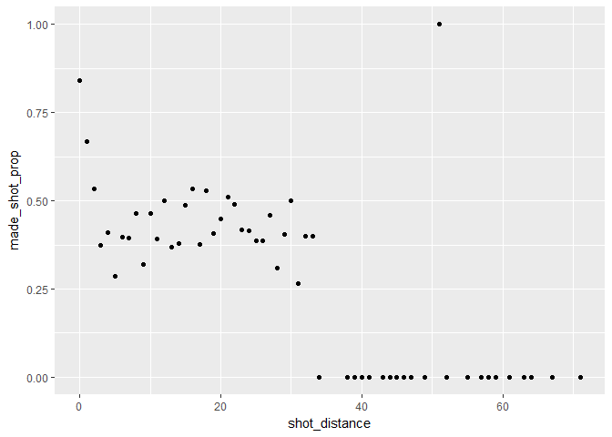
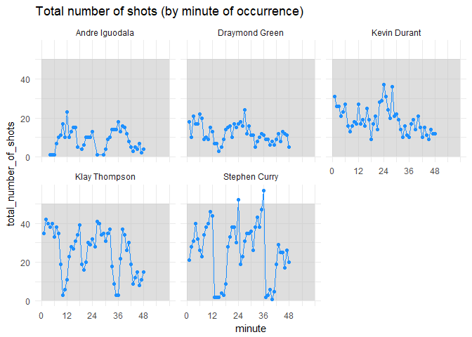

<<<<<<< HEAD
HW 02 - Shot Charts
================
Sofia Guo
March 9, 2018

5.1) Total Shots by Player
==========================

``` r
library(dplyr)
```

    ## 
    ## Attaching package: 'dplyr'

    ## The following objects are masked from 'package:stats':
    ## 
    ##     filter, lag

    ## The following objects are masked from 'package:base':
    ## 
    ##     intersect, setdiff, setequal, union

``` r
library(magrittr)
library(readr)
shotsdata <- read.csv("../data/shots-data.csv", stringsAsFactors = FALSE)
#total number of shots by player, arranged in descending order
players <- group_by(shotsdata, name)
inc <- as_tibble(summarize(players,total = n()))
tot_shots <- arrange(inc, desc(total))
tot_shots
```

    ## # A tibble: 5 x 2
    ##   name           total
    ##   <chr>          <int>
    ## 1 Stephen Curry   1250
    ## 2 Klay Thompson   1220
    ## 3 Kevin Durant     915
    ## 4 Draymond Green   578
    ## 5 Andre Iguodala   371

5.2) Effective Shooting Percentage
==================================

``` r
#effective shooting % by player
players <- group_by(shotsdata, name, shot_made_flag)
inc <- as_tibble(summarize(players,made = n()))
mshots <- filter(inc, shot_made_flag=='made shot')
decmshots <- arrange(mshots, desc(made))
decmshots$total <- tot_shots$total
woperc <- select(decmshots, c(1, 4, 3))
wperc <- mutate(woperc, perc_made = made/total*100)
arrange(wperc, desc(perc_made))
```

    ## # A tibble: 5 x 4
    ## # Groups: name [5]
    ##   name           total  made perc_made
    ##   <chr>          <int> <int>     <dbl>
    ## 1 Kevin Durant     915   495      54.1
    ## 2 Andre Iguodala   371   192      51.8
    ## 3 Klay Thompson   1220   575      47.1
    ## 4 Stephen Curry   1250   584      46.7
    ## 5 Draymond Green   578   245      42.4

``` r
#2PT effective shooting % by player
players1 <- group_by(shotsdata, name, shot_type, shot_made_flag)
inc1 <- as_tibble(summarize(players1, made = n()))
mshots1 <- filter(inc1, shot_made_flag=='made shot', shot_type == '2PT Field Goal')
decmshots1 <- arrange(mshots1, desc(made))
decmshots1$total <- tot_shots$total[c(3,2,1,4,5)]
undecmshots1 <- ungroup(decmshots1)
woperc1 <- select(undecmshots1, c(1, 5, 4))
wperc1 <- mutate(woperc1, perc_made = made/total*100)
arrange(wperc1, desc(perc_made))
```

    ## # A tibble: 5 x 4
    ##   name           total  made perc_made
    ##   <chr>          <int> <int>     <dbl>
    ## 1 Kevin Durant     915   390      42.6
    ## 2 Andre Iguodala   371   134      36.1
    ## 3 Draymond Green   578   171      29.6
    ## 4 Klay Thompson   1220   329      27.0
    ## 5 Stephen Curry   1250   304      24.3

``` r
#3PT effective shooting % by player
players2 <- group_by(shotsdata, name, shot_type, shot_made_flag)
inc2 <- as_tibble(summarize(players2, made = n()))
mshots2 <- filter(inc2, shot_made_flag=='made shot', shot_type == '3PT Field Goal')
decmshots2 <- arrange(mshots2, desc(made))
decmshots2$total <- tot_shots$total
undecmshots2 <- ungroup(decmshots2)
woperc2 <- select(undecmshots2, c(1, 5, 4))
wperc2 <- mutate(woperc2, perc_made = made/total*100)
arrange(wperc2, desc(perc_made))
```

    ## # A tibble: 5 x 4
    ##   name           total  made perc_made
    ##   <chr>          <int> <int>     <dbl>
    ## 1 Stephen Curry   1250   280      22.4
    ## 2 Klay Thompson   1220   246      20.2
    ## 3 Andre Iguodala   371    58      15.6
    ## 4 Draymond Green   578    74      12.8
    ## 5 Kevin Durant     915   105      11.5

6) Shooting Distance
====================

6.1) dplyr table
----------------

``` r
#tibble with shot_distance and made_shot_prop

dist_prop <- shotsdata %>%
  group_by(shot_distance) %>%
  mutate(made_prop = ((shot_made_flag == 'made shot') / n())) %>%
  summarize(made_shot_prop = sum(made_prop))
dist_prop
```

    ## # A tibble: 56 x 2
    ##    shot_distance made_shot_prop
    ##            <int>          <dbl>
    ##  1             0          0.841
    ##  2             1          0.668
    ##  3             2          0.534
    ##  4             3          0.373
    ##  5             4          0.411
    ##  6             5          0.286
    ##  7             6          0.396
    ##  8             7          0.395
    ##  9             8          0.463
    ## 10             9          0.321
    ## # ... with 46 more rows

6.2) ggplot
-----------

``` r
library(ggplot2)
ggplot(dist_prop, aes(shot_distance, made_shot_prop)) + geom_point()
```

 Observations: 1. As the shot distance goes beyond 40, the proportion becomes extremely low (almost always zero). There is one outlier where the shot was made around 51 feet. 2. Preliminarily yes; judging from this data set, it is virtually impossible to make shots beyond 40 feet away from the basket. 3. My guesstimate is around 40 feet. 4. Distances below 5 have 50% or more chance of making it.

7) Total number of shots by min of occurrence
=============================================

``` r
mins <- shotsdata %>%
  group_by(minute, name) %>%
  summarize(total_number_of_shots = n())

ggplot(mins, aes(minute, total_number_of_shots)) + annotate("rect", fill="gray", alpha = 0.5, xmin=seq(0, 50, 12), xmax=seq(12, 60, 12),ymin=0, ymax=50) + geom_point(color = 'dodgerblue1') + geom_path(color = 'dodgerblue1') + facet_wrap(~name) + theme_minimal() + scale_x_continuous(breaks = seq(0, 48, 12)) + ggtitle('Total number of shots (by minute of occurrence)') +scale_fill_gradient2(low = "red", high ="blue")
```


=======
HW 02 - Shot Charts
================
Sofia Guo
March 9, 2018

5.1) Total Shots by Player
==========================

``` r
library(dplyr)
```

    ## 
    ## Attaching package: 'dplyr'

    ## The following objects are masked from 'package:stats':
    ## 
    ##     filter, lag

    ## The following objects are masked from 'package:base':
    ## 
    ##     intersect, setdiff, setequal, union

``` r
library(magrittr)
library(readr)
shotsdata <- read.csv("../data/shots-data.csv", stringsAsFactors = FALSE)
#total number of shots by player, arranged in descending order
players <- group_by(shotsdata, name)
inc <- as_tibble(summarize(players,total = n()))
tot_shots <- arrange(inc, desc(total))
tot_shots
```

    ## # A tibble: 5 x 2
    ##   name           total
    ##   <chr>          <int>
    ## 1 Stephen Curry   1250
    ## 2 Klay Thompson   1220
    ## 3 Kevin Durant     915
    ## 4 Draymond Green   578
    ## 5 Andre Iguodala   371

5.2) Effective Shooting Percentage
==================================

``` r
#effective shooting % by player
players <- group_by(shotsdata, name, shot_made_flag)
inc <- as_tibble(summarize(players,made = n()))
mshots <- filter(inc, shot_made_flag=='made shot')
decmshots <- arrange(mshots, desc(made))
decmshots$total <- tot_shots$total
woperc <- select(decmshots, c(1, 4, 3))
wperc <- mutate(woperc, perc_made = made/total*100)
arrange(wperc, desc(perc_made))
```

    ## # A tibble: 5 x 4
    ## # Groups: name [5]
    ##   name           total  made perc_made
    ##   <chr>          <int> <int>     <dbl>
    ## 1 Kevin Durant     915   495      54.1
    ## 2 Andre Iguodala   371   192      51.8
    ## 3 Klay Thompson   1220   575      47.1
    ## 4 Stephen Curry   1250   584      46.7
    ## 5 Draymond Green   578   245      42.4

``` r
#2PT effective shooting % by player
players1 <- group_by(shotsdata, name, shot_type, shot_made_flag)
inc1 <- as_tibble(summarize(players1, made = n()))
mshots1 <- filter(inc1, shot_made_flag=='made shot', shot_type == '2PT Field Goal')
decmshots1 <- arrange(mshots1, desc(made))
decmshots1$total <- tot_shots$total[c(3,2,1,4,5)]
undecmshots1 <- ungroup(decmshots1)
woperc1 <- select(undecmshots1, c(1, 5, 4))
wperc1 <- mutate(woperc1, perc_made = made/total*100)
arrange(wperc1, desc(perc_made))
```

    ## # A tibble: 5 x 4
    ##   name           total  made perc_made
    ##   <chr>          <int> <int>     <dbl>
    ## 1 Kevin Durant     915   390      42.6
    ## 2 Andre Iguodala   371   134      36.1
    ## 3 Draymond Green   578   171      29.6
    ## 4 Klay Thompson   1220   329      27.0
    ## 5 Stephen Curry   1250   304      24.3

``` r
#3PT effective shooting % by player
players2 <- group_by(shotsdata, name, shot_type, shot_made_flag)
inc2 <- as_tibble(summarize(players2, made = n()))
mshots2 <- filter(inc2, shot_made_flag=='made shot', shot_type == '3PT Field Goal')
decmshots2 <- arrange(mshots2, desc(made))
decmshots2$total <- tot_shots$total
undecmshots2 <- ungroup(decmshots2)
woperc2 <- select(undecmshots2, c(1, 5, 4))
wperc2 <- mutate(woperc2, perc_made = made/total*100)
arrange(wperc2, desc(perc_made))
```

    ## # A tibble: 5 x 4
    ##   name           total  made perc_made
    ##   <chr>          <int> <int>     <dbl>
    ## 1 Stephen Curry   1250   280      22.4
    ## 2 Klay Thompson   1220   246      20.2
    ## 3 Andre Iguodala   371    58      15.6
    ## 4 Draymond Green   578    74      12.8
    ## 5 Kevin Durant     915   105      11.5

6) Shooting Distance
====================

6.1) dplyr table
----------------

``` r
#tibble with shot_distance and made_shot_prop

dist_prop <- shotsdata %>%
  group_by(shot_distance) %>%
  mutate(made_prop = ((shot_made_flag == 'made shot') / n())) %>%
  summarize(made_shot_prop = sum(made_prop))
dist_prop
```

    ## # A tibble: 56 x 2
    ##    shot_distance made_shot_prop
    ##            <int>          <dbl>
    ##  1             0          0.841
    ##  2             1          0.668
    ##  3             2          0.534
    ##  4             3          0.373
    ##  5             4          0.411
    ##  6             5          0.286
    ##  7             6          0.396
    ##  8             7          0.395
    ##  9             8          0.463
    ## 10             9          0.321
    ## # ... with 46 more rows

6.2) ggplot
-----------

``` r
library(ggplot2)
ggplot(dist_prop, aes(shot_distance, made_shot_prop)) + geom_point()
```

 Observations: 1. As the shot distance goes beyond 40, the proportion becomes extremely low (almost always zero). There is one outlier where the shot was made around 51 feet. 2. Preliminarily yes; judging from this data set, it is virtually impossible to make shots beyond 40 feet away from the basket. 3. My guesstimate is around 40 feet. 4. Distances below 5 have 50% or more chance of making it.

7) Total number of shots by min of occurrence
=============================================

``` r
mins <- shotsdata %>%
  group_by(minute, name) %>%
  summarize(total_number_of_shots = n())

ggplot(mins, aes(minute, total_number_of_shots)) + annotate("rect", fill="gray", alpha = 0.5, xmin=seq(0, 50, 12), xmax=seq(12, 60, 12),ymin=0, ymax=50) + geom_point(color = 'dodgerblue1') + geom_path(color = 'dodgerblue1') + facet_wrap(~name) + theme_minimal() + scale_x_continuous(breaks = seq(0, 48, 12)) + ggtitle('Total number of shots (by minute of occurrence)') +scale_fill_gradient2(low = "red", high ="blue")
```


>>>>>>> 98aebd82c21e4ca13d630d895fdffb40db07cde1
