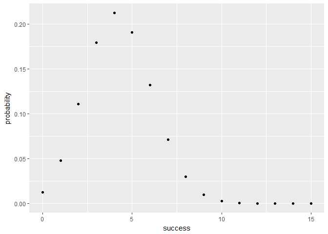

hw03-sofia-guo
================
Sofia
March 21, 2018

Piping
======

2.1)
----

    #Unique team names redirected to text file team-names.txt
    cut -d "," -f 2 nba2017-roster.csv |tail +2 | sort -u > team-names.txt
    head team-names.txt

2.2)
====

    #Unique positions
    cut -d "," -f 2 nba2017-roster.csv | tail +2 | sort -u > position-names.txt
    head position-names.txt

2.3)
====

    #counts of different experience values, displayed largest to smallest
    cut -d "," -f 7 nba2017-roster.csv |tail +2 | sort -n| uniq -c > experience-counts.txt

2.4)
====

    #create csv file LAC.csv with data for LAC team, including column names. use cat to display data
    egrep "LAC|team" nba2017-roster.csv > LAC.csv
    cat LAC.csv

2.5)
====

    #Write pipeline to display age freq of LAL players
     grep "LAL" nba2017-roster.csv | cut -d "," -f 6 | sort -n | uniq -c

2.6)
====

    #Write pipeline to find number of players in CLE team; output should just be number of players
    grep "CLE" nba2017-roster.csv | cut -d "," -f 2 | uniq -c

2.7)
====

    #Write pipelines to create a CSV file gsw-height-weight.csv containing player, height and weight of GSW
    egrep "GSW|team" nba2017-roster.csv | cut -d "," -f1,4,5 > gsw-height-weight.csv

2.8)
====

    #Write pipelines to create file top10-salaries.csv containing top 10 player salaries arranged by salary from largest to smallest
    cut -d "," -f 1,8 nba2017-roster.csv | sort -t "," -k 2,2 -n -r > top10-salaries.csv

3) sourcing R script
====================

``` r
source('C:/Users/Sammy/Desktop/hw-stat133/hw03/code/binomial-functions.R')
```

calculate probabilities
=======================

``` r
#prob get 3 sixes in 10 rolls
bin_probability(10, 3, 1/6)
```

    ## [1] 0.1550454

``` r
#dist of 3 sixes in 10 rolls of loaded die p = 0.25
bin_distribution(10, 0.25)
```

    ##    success  probability
    ## 1        0 1.877117e-01
    ## 2        1 2.815676e-01
    ## 3        2 2.502823e-01
    ## 4        3 1.459980e-01
    ## 5        4 5.839920e-02
    ## 6        5 1.622200e-02
    ## 7        6 3.089905e-03
    ## 8        7 3.862381e-04
    ## 9        8 2.861023e-05
    ## 10       9 9.536743e-07
    ## 11      10 0.000000e+00

``` r
library(ggplot2)
ggplot(bin_distribution(10, 0.25), aes(success, probability)) + geom_point()
```


``` r
#prob of more than 3 heads in 5 tosses with biased coin 0.35 chance heads
for (i in 4:5) {
    x <- bin_probability(5, i, 0.35) 
}
x
```

    ## [1] 0.005252187

``` r
#probability dist of number of head when tossing loaded coin 15 times with 0.35 chance heads; make plot
bin_distribution(15, 0.35)
```

    ##    success  probability
    ## 1        0 1.261672e-02
    ## 2        1 4.755531e-02
    ## 3        2 1.109624e-01
    ## 4        3 1.792469e-01
    ## 5        4 2.123387e-01
    ## 6        5 1.905604e-01
    ## 7        6 1.319264e-01
    ## 8        7 7.103729e-02
    ## 9        8 2.975066e-02
    ## 10       9 9.611752e-03
    ## 11      10 2.352527e-03
    ## 12      11 4.222484e-04
    ## 13      12 5.246873e-05
    ## 14      13 4.036056e-06
    ## 15      14 1.448841e-07
    ## 16      15 0.000000e+00

``` r
ggplot(bin_distribution(15, 0.35), aes(success, probability)) + geom_point()
```


